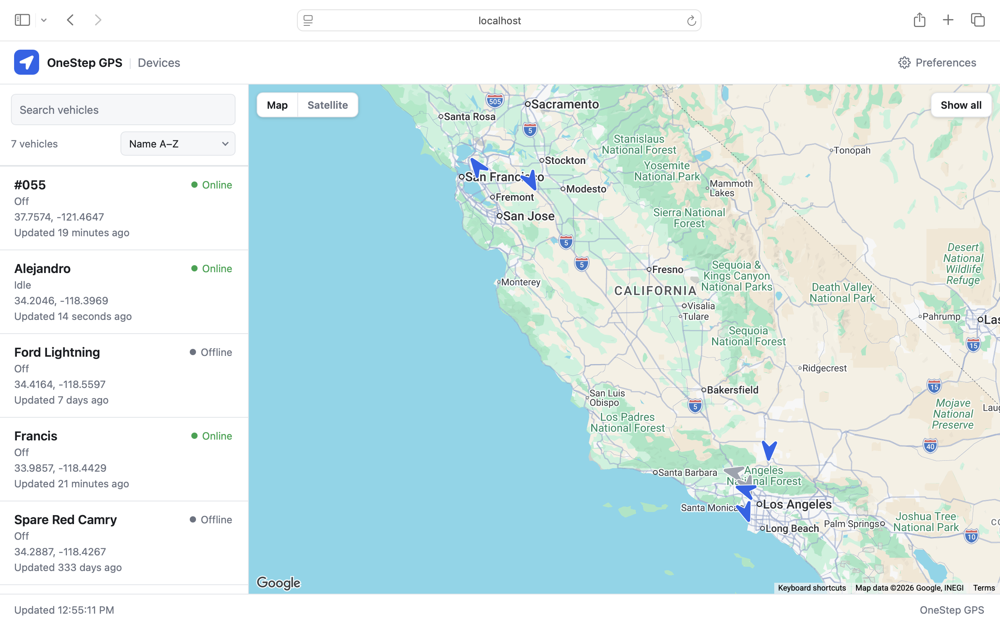
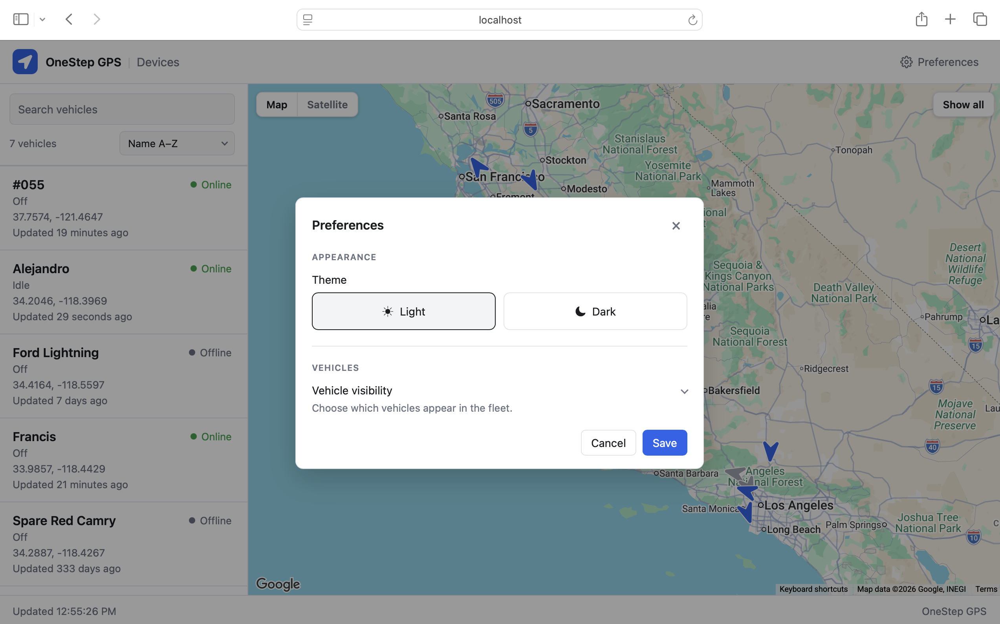

# OneStep GPS Dashboard

Take-home project for OneStep GPS.

A small dashboard for OneStep GPS devices: list them, plot their current positions on a map, and save preferences on the server.

## Screenshots





## Layout

- `server/` — Go API. Talks to the OneStep GPS public device endpoint, stores user preferences, and exposes the JSON the UI needs.
- `ui/` — Vue frontend. Device list, preference editing, and a live map.

Preferences are stored behind a storage interface in the server so the rest of the app does not depend on a specific database.

## Setup

### Prerequisites

- Go 1.25+
- Node `^22.18.0 || >=24.12.0`
- A OneStep GPS public API key (`ONESTEP_API_KEY` — the server will not start without it)
- A Google Maps JavaScript API key for the dashboard map

### 1. Clone

```bash
git clone https://github.com/davidlira1/onestepgps-take-home.git
cd onestepgps-take-home
```

### 2. Start the Go API

```bash
cd server
export ONESTEP_API_KEY=your-key
go run ./cmd/server
```

The server listens on port 8080 by default.

### 3. Start the Vue app

In another terminal:

```bash
cd ui
export VITE_GOOGLE_MAPS_API_KEY=your-maps-key
npm install
npm run dev
```

Open the Vite URL (typically `http://localhost:5173`). Vite proxies `/api` to `http://localhost:8080`, so the browser can call the Go API without CORS.

Restart `npm run dev` after changing exported Vite variables.

### Optional: mock devices

To serve the device list from a local mock fleet instead of `GET /api/devices` (no OneStep GPS calls):

```bash
export VITE_USE_MOCK_DEVICES=true
npm run dev
```

The mock fleet still moves on the 5-second poll. Preferences still go through the Go API.

### Tests

```bash
cd server && go test ./...
cd ui && npm test
```

## API

HTTP endpoints live in the [server README](server/README.md#api).

## Features

- Live device list
- Google Maps device locations
- 5-second background refresh
- Heading / online map markers
- Fleet search by name
- SQLite preferences
  - Sort order
  - Hidden devices
  - Light / dark theme
  - Map / Satellite

## Realtime

Vue polls `GET /api/devices` every 5 seconds. Go fetches the latest OneStep GPS positions on each of those requests. Existing map markers move and rotate in place instead of being recreated.

This take-home uses client polling: each browser hits `/api/devices` on a timer. That is simple, matches the existing REST API, and is easy to test. The cost is that every open dashboard independently calls Go, and Go independently calls OneStep, so upstream load grows with the number of clients.

If a stream API had been provided for this take-home, the server could subscribe once and push position updates instead of polling.
